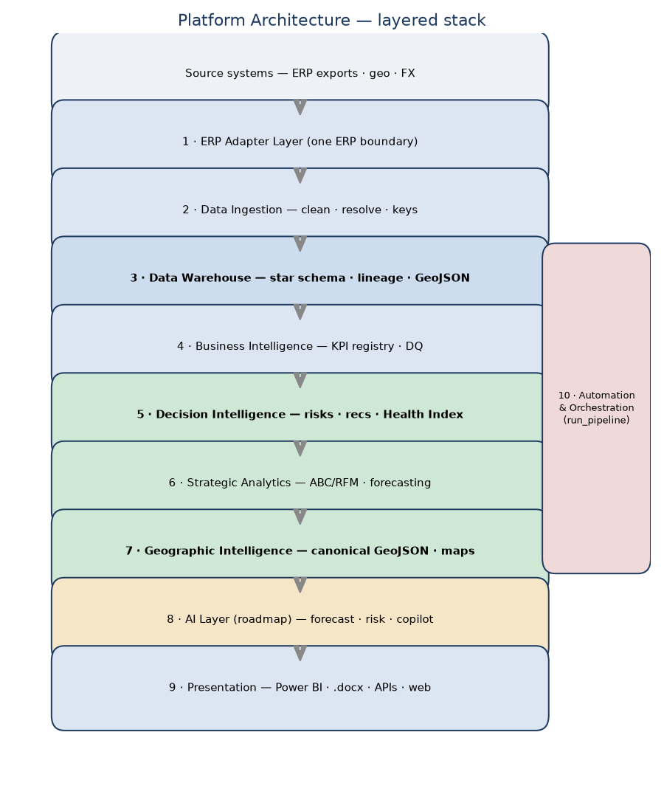

# Pharmaceutical Distribution Intelligence Platform

**Version 1.0** · Python 3.11 · 81 automated tests · reconciled to the rupee · PII-safe

A production-quality decision-support platform that turns raw ERP exports from a
mid-size pharmaceutical distributor into a **trusted warehouse, decision
intelligence, strategic analytics, geographic intelligence, Power BI exports, and
an executive report** — from a single command. One codebase, two modes: an
**internal** tool on real data and a **shareable**, fully anonymised portfolio
version.

> ⚠️ **Real company data with sensitive PII.** Read [SECURITY.md](SECURITY.md).
> No raw, processed, or warehouse data is ever committed; shareable outputs are
> anonymised and pass an automated PII audit.



## What it does

| Layer | Capability |
|---|---|
| **ERP Adapter** | One ERP boundary; canonical, ERP-agnostic data (32 report types) |
| **Warehouse** | SQLite star schema; lineage/audit/quality on every row; **4/4 reconciliations exact, 0 orphan keys** |
| **Decision Intelligence** | Insights, risks, opportunities, ranked recommendations, scorecards, and a configurable **Business Health Index** |
| **Strategic Analytics** | ABC/Pareto, RFM, lifecycle, seasonality, trends, ageing, and **forecasting with confidence intervals + model quality + assumptions** |
| **Geographic Intelligence** | **GeoJSON-canonical GIS** — district/taluka/village boundaries, territories, routes, customer/warehouse points; interactive Leaflet map |
| **Presentation** | Power BI star-schema CSV + GeoJSON exports; executive Business Health Report (`.docx`) |

## Quick start

```bash
py -3.11 -m venv venv && venv\Scripts\activate     # Windows (see docs/INSTALLATION.md)
pip install -r requirements.txt
python run_pipeline.py --mode internal --currency INR     # builds everything (10 stages)
```
No real data? Explore the anonymised **[samples/](samples/)** dataset (CSV + GeoJSON).

## Documentation

- **Architecture & vision:** [ARCHITECTURE.md](docs/ARCHITECTURE.md) ·
  [Platform Vision & Roadmap (.docx)](reports/shareable/Platform_Vision_and_Roadmap_v1.0.docx)
- **Roadmaps:** [AI_ROADMAP.md](docs/AI_ROADMAP.md) · [GIS_ROADMAP.md](docs/GIS_ROADMAP.md) ·
  [ERP_EXPANSION.md](docs/ERP_EXPANSION.md) · [SAAS_VISION.md](docs/SAAS_VISION.md) ·
  [MATURITY_MODEL.md](docs/MATURITY_MODEL.md)
- **Data model:** [data_model.md](docs/data_model.md) ·
  [warehouse_schema.md](docs/warehouse_schema.md) ·
  [data_dictionary.md](docs/data_dictionary.md) ·
  [business_metadata_catalog.md](docs/business_metadata_catalog.md)
- **Guides:** [Installation](docs/INSTALLATION.md) · [Deployment](docs/DEPLOYMENT.md) ·
  [User](docs/USER_GUIDE.md) · [Administrator](docs/ADMINISTRATOR_GUIDE.md) ·
  [Developer](docs/DEVELOPER_GUIDE.md) · [Maintenance](docs/warehouse_maintenance.md)
- **Dashboards (Power BI):** [dashboards/specs/](dashboards/specs/) (8 stakeholder specs + data model + DAX + template)
- **Release:** [RELEASE_NOTES.md](RELEASE_NOTES.md) · [CHANGELOG.md](CHANGELOG.md) ·
  [Known limitations](docs/KNOWN_LIMITATIONS.md)

## Key architectural decisions

- **Raw is immutable**; every load reconciles to the ERP's own totals to the rupee.
- **Config over code** — column maps, report specs, KPI thresholds, currency,
  health-index weights, churn rules, and geocoding all live in `config/`.
- **Schema-as-data** — the warehouse schema and KPI registry generate their own docs.
- **INR is the source of truth**; currency conversion is presentation-only.
- **GeoJSON is the canonical spatial format**; lat/lon is only a geocoding cache.
- **PII-first** — anonymisation + audit gate every shareable output.
- **Future-proofed** — reserved tables for line items, GPS traces, and vehicle
  routes mean v2.0/v3.0 add layers, never a redesign.

## Repository layout

```
src/        adapters · warehouse · di · strategic · geo(/gis) · powerbi · report
config/     YAML config + geo_reference.csv
data/        raw / warehouse / secure / reference / geo   (gitignored)
reports/    internal (gitignored) + shareable (anonymised)
dashboards/ specs/ (Power BI) + geo/ (interactive map, gitignored)
docs/       architecture, roadmaps, guides, generated dictionary/catalog, diagrams
samples/    anonymised demo dataset (CSV + GeoJSON)
tests/      pytest suite (81 tests)
run_pipeline.py   one-command pipeline (10 stages)
```

## Status — v1.0 (a platform, not a finished project)

Phases 0 → 7 complete. See [MATURITY_MODEL.md](docs/MATURITY_MODEL.md) for the
v2.0 (predictive/AI) and v3.0 (autonomous/multi-tenant SaaS) roadmap.

*Built as a real business system and a portfolio demonstration of data
engineering, BI, decision intelligence, GIS, and platform architecture.*
