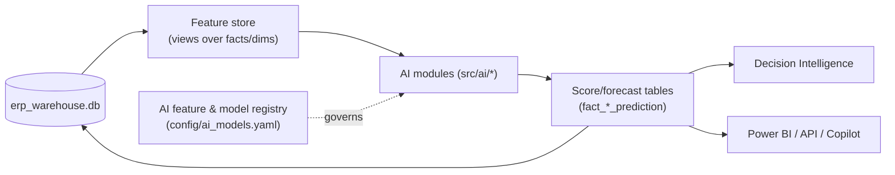

# AI Roadmap

> How the platform's **AI Layer** (`src/ai/`, future) grows on top of the existing
> warehouse and KPI registry. Every module reads the same conformed star schema
> and writes back scores/forecasts as new fact/mart tables — **no warehouse
> redesign**. Each AI module ships, like the v1.0 forecaster, with confidence,
> assumptions, model-quality metrics, and a plain-business explanation.

## How AI plugs in (no redesign)

- A **feature store** = curated SQL views over the warehouse (no new raw data).
- Each model writes predictions back as `fact_<x>_prediction` tables that carry
  the same lineage/quality columns — so they're first-class warehouse citizens.
- A model **registry** (`config/ai_models.yaml`) records each model's features,
  target, metrics, version, and refresh cadence (schema-as-data, like the KPI
  registry).

## The 12 modules

Priority key: **P1** = now/next (v1.x), **P2** = v2.0, **P3** = v3.0.
Complexity: Low / Medium / High.

| # | Module | Required data | Expected business value | Complexity | Priority |
|---|---|---|---|---|---|
| 1 | **Sales Forecasting** | monthly fact_sales (have) | plan cash, inventory, capacity; already prototyped (Prophet, MAPE ~11%) | Low | **P1** |
| 2 | **Demand Forecasting** | product-month sales (needs line items) | SKU-level reorder & scheme planning; cut stockouts and dead stock | High | **P2** |
| 3 | **Cash-Flow Forecasting** | sales, purchases, AR/AP ageing, terms | 30/60/90-day cash visibility; avoid crunches | Medium | **P1** |
| 4 | **Inventory Optimization** | stock snapshots, demand forecast, lead times | minimise working capital while holding service level | High | **P2** |
| 5 | **Purchase Recommendation Engine** | demand forecast, stock, supplier terms, PTR changes | auto reorder proposals; better scheme timing | Medium | **P2** |
| 6 | **Pricing Optimization** | product margins, volumes, elasticity proxies, PTR/MRP | lift margin on low-margin high-volume SKUs | High | **P2** |
| 7 | **Customer Risk Prediction** | RFM, recency/churn, ageing, order cadence | predict churn & credit risk; prioritise route win-back | Medium | **P1** |
| 8 | **Supplier Risk Prediction** | spend concentration, price volatility, dependency | flag continuity/price risk before it bites | Medium | **P2** |
| 9 | **Territory Recommendation Engine** | GeoJSON territories, route productivity, white-space | rebalance routes; target expansion towns | Medium | **P2** |
| 10 | **Route Optimization Engine** | GeoJSON routes, stops, (future) GPS + drive-time | cut km/fuel/time; sequence stops; capacity by day | High | **P3** |
| 11 | **Natural-Language Business Assistant** | warehouse + KPI registry + reports | ask questions in plain language → governed answers | Medium | **P2** |
| 12 | **Executive Copilot** | all of the above + recommendations + alerts | proactive briefings, "what changed & why", next actions | High | **P3** |

## Sequencing rationale

- **P1 (v1.x)** uses data we already have at the grain we have it: sales/cash
  forecasting and customer-risk scoring extend the existing DI layer directly.
- **P2 (v2.0)** unlocks once **line-item exports** arrive (demand, inventory,
  pricing, purchase recommendations) and as the geo layer matures (territory,
  supplier risk, NL assistant).
- **P3 (v3.0)** is the optimisation/agentic tier (route optimisation with GPS,
  Executive Copilot) — highest value, highest data and engineering bar.

## Responsible-AI guardrails (apply to every module)

- **Explainability first** — every score/forecast carries drivers, confidence,
  and assumptions; no black-box numbers in front of the owner.
- **Backtested quality** — out-of-sample metrics (MAPE/RMSE/AUC) reported with
  each model; degradation alerts on drift.
- **Human-in-the-loop** — recommendations, never silent automated actions, until
  proven; the same "never silently merge / never silently drop" stance as v1.0.
- **PII-safe** — models train on coded entities; the anonymisation boundary holds.
