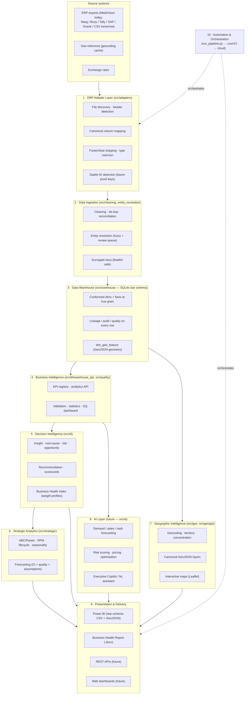
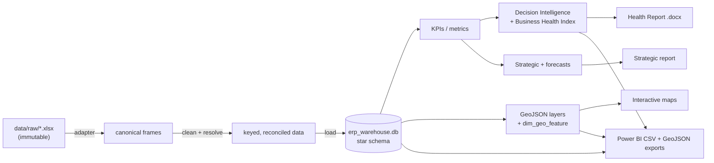

# Platform Architecture

> **Pharmaceutical Distribution Intelligence Platform** — v1.0.
> This document is the canonical description of the product architecture: the
> layers, how data flows through them, and how each layer is isolated so it can
> evolve independently.

## 1. Architectural principles

1. **Layered & loosely coupled.** Each layer depends only on the contract of the
   layer below. The ERP can change, the warehouse can move to Postgres, the BI
   tool can change — without rewriting analytics.
2. **One ERP boundary.** All ERP-specific knowledge lives in the *Adapter Layer*.
   Everything above it sees only canonical, ERP-agnostic data.
3. **Config over code.** Column maps, report specs, KPI thresholds, currency
   rates, health-index weights, churn rules, and geocoding all live in `config/`.
4. **Schema-as-data.** The warehouse schema, KPI registry, and (future) AI feature
   registry are declarative — documentation and physical artifacts are generated
   from them, so they never drift.
5. **INR is the source of truth.** Money is stored once in INR; currency is a
   presentation concern.
6. **GeoJSON is the canonical spatial format.** Lat/lon is only a geocoding cache.
7. **PII-first.** Anonymisation and audit gate every shareable output.
8. **Reproducible.** One command (`run_pipeline.py`) rebuilds everything;
   raw data is immutable and reconciled to the rupee at every step.

## 2. The layer stack

## 3. Layer responsibilities

| # | Layer | Today (v1.0) | Module(s) |
|---|---|---|---|
| 1 | **ERP Adapter** | MediVision Platinum exports → canonical frames | `src/adapters/` |
| 2 | **Data Ingestion** | clean, reconcile, resolve entities, mint keys | `src/cleaning*`, `src/entity_resolution.py` |
| 3 | **Data Warehouse** | SQLite star schema, lineage/audit/quality, spatial table | `src/warehouse/` |
| 4 | **Business Intelligence** | KPI registry, validation, statistics, DQ dashboard | `src/di/kpis.py`, `src/quality.py`, `src/warehouse/{validation,stats}.py` |
| 5 | **Decision Intelligence** | insights, risks, opportunities, recommendations, BHI | `src/di/` |
| 6 | **Strategic Analytics** | ABC/RFM/lifecycle/seasonality/forecasting | `src/strategic/` |
| 7 | **Geographic Intelligence** | geocoding, territory, **canonical GeoJSON**, maps | `src/geo/`, `src/geo/gis/` |
| 8 | **AI Layer** | *(roadmap)* forecasting, risk, pricing, copilot | `src/ai/` (future) |
| 9 | **Presentation** | Power BI exports, .docx reports, *(future)* APIs/web | `src/powerbi/`, `src/report/` |
| 10 | **Automation** | one-command pipeline → cron/CI → cloud | `run_pipeline.py` |

## 4. Data flow (end to end)

Every money figure reconciles to the ERP's own report totals to the rupee at the
warehouse boundary; nothing downstream can silently diverge.

## 5. Cross-cutting concerns

- **Security / PII** — `src/anonymise.py` + `src/pii_audit.py`; internal vs
  shareable modes; `SECURITY.md`.
- **Multi-currency** — `src/currency.py`, `config/currency_config.yaml`.
- **Quality & lineage** — every warehouse row carries source report/year/file,
  import batch, timestamp, and a record-quality status.
- **Configuration** — `config/*.yaml` (+ `config/geo_reference.csv`).

## 6. Why this architecture lasts 10 years

The contracts between layers are stable; the implementations behind them are
swappable. A new ERP touches only Layer 1. A move to Postgres or a cloud warehouse
touches only Layer 3. New AI modules read the same warehouse and KPI registry.
The spatial layer already speaks GeoJSON, so GPS/telematics and routing add new
*tables and modules*, never a redesign. See `AI_ROADMAP.md`, `GIS_ROADMAP.md`,
`ERP_EXPANSION.md`, and `SAAS_VISION.md`.
