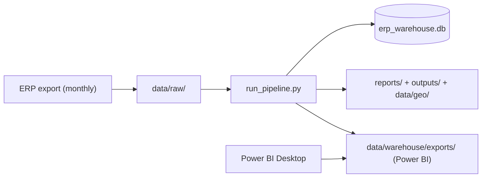

# Deployment Guide

v1.0 deploys as a **scheduled local/desktop pipeline**. This guide covers that and
the path to server/cloud (per `docs/SAAS_VISION.md`).

## Topology (v1.0)

## Standard operating procedure (monthly refresh)
1. Export the latest reports from the ERP into `data/raw/<Domain>/` (same naming).
2. Run `python run_pipeline.py --mode internal --currency INR`.
3. Confirm **`4/4 reconciliation PASS`** and review `reports/data_validation.md`.
4. Refresh Power BI (point it at `data/warehouse/exports/internal/`).
5. For the portfolio/shareable set: `--mode shareable`, then
   `python -m src.pii_audit --shareable` before sharing.

## Scheduling
- **Windows Task Scheduler / cron** → run the pipeline after the ERP export.
- Recommended cadence: monthly (or weekly during peak Jul–Sep season).

## Hardening for a server (pre-SaaS)
- Move the warehouse to **Postgres** (swap the SQLAlchemy engine in
  `src/warehouse/db.py`); the schema registry is dialect-generic.
- Run the pipeline in a **container**; mount object storage for `data/`.
- Store secrets (.env, FX/API keys) in a secrets manager.
- Emit the structured JSON feeds (`reports/*.json`, GeoJSON) behind a small REST
  service for dashboards.

## Backup & recovery
- Back up `data/secure/pii_lookup.csv` (the only real↔code bridge) and
  `data/reference/` securely and separately.
- The warehouse and all reports are **regenerable** from `data/raw/` + config —
  back up raw exports and the repo; everything else rebuilds with one command.

## Health checks
- Pipeline exit code `0` and `reconciliation: 4/4 PASS`.
- `reports/warehouse_statistics.md` orphan keys = 0.
- `python -m src.pii_audit --shareable` passes before any external share.
