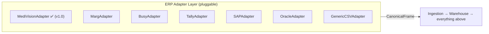

# ERP Expansion — One Adapter Boundary, Many ERPs

> The **ERP Adapter Layer** is the single place that knows anything ERP-specific.
> Adding a new ERP means writing one adapter class that emits the **canonical
> contract** — the warehouse, analytics, decision intelligence, geography, and
> dashboards are untouched.

## The contract every adapter implements

`src/adapters/base.py` defines `ERPAdapter`:

```
list_reports()                  -> available report keys
available_years(report_key)     -> financial years on disk/source
load(report_key, fy)            -> CanonicalFrame   # canonical columns + provenance
load_all_years(report_key)      -> CanonicalFrame   # stacked, FY-tagged
```

A `CanonicalFrame` carries: the dataframe with **canonical column names**, the
report role/grain, financial year, source provenance, detected **stable-ID
columns** (for future-proof keys), and dropped-row counts (reconciliation).
Everything above the adapter consumes only this.



## Per-ERP integration plan

| ERP | Typical interface | Adapter approach | Effort |
|---|---|---|---|
| **MediVision** ✅ | banner Excel exports | implemented (`MediVisionAdapter`): header detection, footer strip, column map | done |
| **Marg** | Excel/DBF exports, similar banner style | subclass; new `column_mappings`/`report_specs`; reuse banner+footer logic | Low |
| **Busy** | Excel/CSV exports | same pattern; map Busy headers → canonical | Low |
| **Tally** | XML / ODBC / Excel | `TallyAdapter` reads Tally XML or ODBC; map vouchers/ledgers → canonical | Medium |
| **SAP** | OData / RFC / table extracts (B1 or ECC) | `SAPAdapter` over OData/extract; map BSEG/VBRK etc. → canonical | High |
| **Oracle** | SQL views / Fusion REST | `OracleAdapter` over JDBC/REST; map AR/AP/INV → canonical | High |
| **Generic CSV** | any tabular export | `GenericCSVAdapter` driven purely by `report_specs.yaml` + column maps | Low |

## What does NOT change when a new ERP is added

- The **warehouse schema** (conformed dims/facts, lineage, spatial table).
- **Entity resolution, currency, KPI registry, Decision Intelligence, Strategic
  Analytics, Geographic Intelligence**.
- **Power BI exports, .docx reports, maps**.
- **Tests** for those layers (they assert on canonical data).

## What you write per ERP

1. A subclass of `ERPAdapter` (often <150 lines; reuse the banner/header/footer
   helpers in `src/utils.py`).
2. ERP-specific entries in `config/column_mappings.yaml` and
   `config/report_specs.yaml` (synonyms + grain/role overrides).
3. A short adapter test (load each report, assert canonical columns).

## Multi-ERP & migration

Because every fact row already records `src_report`/`src_file`/`import_batch_id`,
a business that **migrates ERPs** (e.g., Tally → SAP) keeps a single continuous
warehouse: old data via `TallyAdapter`, new via `SAPAdapter`, unified by canonical
keys. The same mechanism supports a **multi-ERP group** (different branches on
different ERPs) — see `SAAS_VISION.md`.
