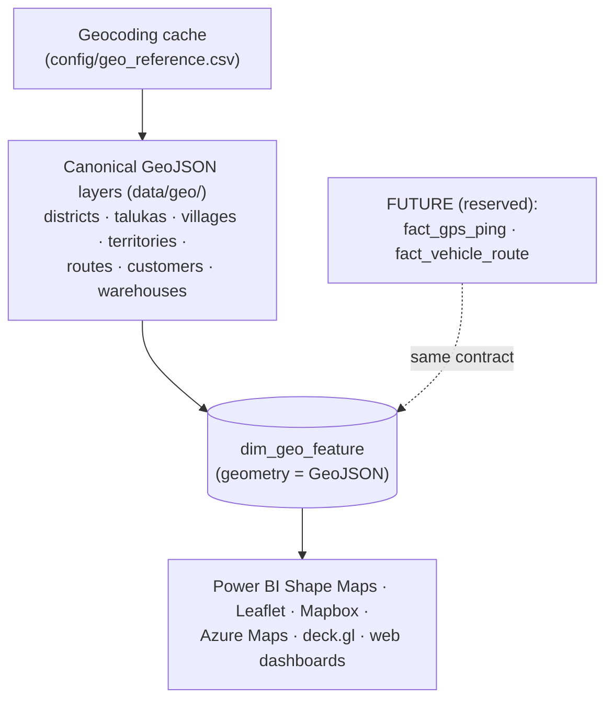

# GIS Roadmap

> v1.0 established **GeoJSON as the canonical spatial format** with a warehouse
> spatial table (`dim_geo_feature`) and two reserved extension points
> (`fact_gps_ping`, `fact_vehicle_route`). Everything below adds new layers,
> tables, and modules **without changing the warehouse architecture** — because
> the spatial contract is already GeoJSON.

## Where v1.0 sits

## Enhancement roadmap

| Enhancement | What it adds | New artifacts (no redesign) | Priority |
|---|---|---|---|
| **Official admin boundaries** | replace synthetic Voronoi cells with real district/taluka/village polygons (GADM / OSM / Census of India) | drop-in GeoJSON to `data/geo/` (same schema); a `boundaries_source` config | **P1** |
| **GPS-enabled delivery tracking** | live/near-real-time vehicle positions | populate `fact_gps_ping` (already in schema) | P2 |
| **Vehicle routing (actual)** | reconstruct driven paths from pings | populate `fact_vehicle_route` (LineStrings) | P2 |
| **Drive-time analysis** | isochrones, planned-vs-actual time | OSRM/Valhalla service + `geo/driving.py`; cache as GeoJSON | P2 |
| **Route optimization** | optimal stop sequencing & day balancing | `geo/optimize.py` (VRP solver) → optimised `routes.geojson` | P3 |
| **Territory balancing** | equal-workload / equal-potential territories | re-dissolve villages by a balanced assignment; new `territories.geojson` | P2 |
| **Warehouse location optimization** | best site(s) for a 2nd depot | facility-location model over demand polygons | P3 |
| **White-space analysis** | uncovered demand pockets | overlay potential (population/pharmacies) vs served villages | P2 |
| **Market penetration maps** | share-of-potential choropleths | join external potential to `villages.geojson` | P2 |
| **Spatial AI** | demand surfaces, GeoAI clustering, hot-spot detection | models read GeoJSON + facts; write score layers | P3 |

## Why no redesign is ever needed

1. **Geometry is already GeoJSON** in `dim_geo_feature` — any new layer (real
   boundaries, isochrones, optimised routes) is just more features with the same
   columns.
2. **GPS and vehicle routes have reserved tables** (`fact_gps_ping`,
   `fact_vehicle_route`) declared in the schema registry today.
3. **Coordinates are a cache, not the model** — swapping the geocoder (to a real
   geocoding API) changes only the cache, not any consumer.
4. **Consumers read standard GeoJSON** — Power BI/Leaflet/Mapbox/Azure/deck.gl
   need no project-specific format.

## Migration path to real boundaries (P1, concrete)

1. Obtain district/taluka/village polygons (GADM L2/L3 or Census shapefiles) for
   Pune & Ahmednagar; convert to GeoJSON (EPSG:4326).
2. Place as `data/geo/districts.geojson` etc. with properties `{name, ...}`.
3. Set `config/geo.yaml: boundaries_source: official`. The loader prefers official
   geometry and falls back to Voronoi where a polygon is missing.
4. Re-run the pipeline — choropleths, dissolves, and `dim_geo_feature` repopulate
   automatically; metrics bind by name. No code change.
