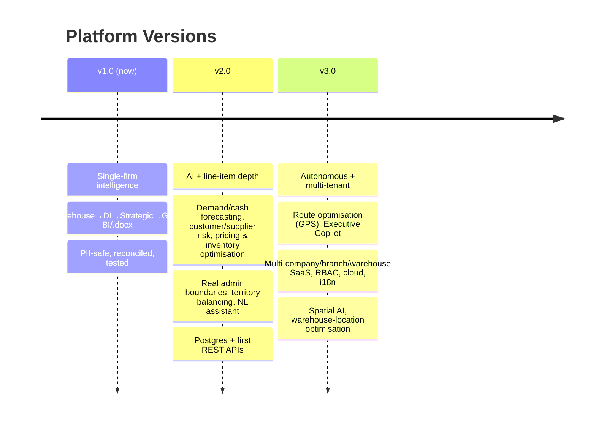

# Platform Maturity Model & Version Roadmap

> Where the Pharmaceutical Distribution Intelligence Platform sits today, and what
> v2.0 and v3.0 introduce. This is a **product**, not a finished project.

## Capability maturity (today, v1.0)

Scale: ◐ partial · ● mature · ○ planned

| Capability | Maturity | Notes |
|---|:--:|---|
| ERP ingestion (1 ERP) | ● | MediVision adapter; reconciled to the rupee |
| Data warehouse (star schema) | ● | lineage/audit/quality on every row |
| Data quality & validation | ● | DQ dashboard, validation report, 81 tests |
| Business Intelligence (KPIs) | ● | central registry, Power BI exports |
| Decision Intelligence | ● | insights/risks/opportunities/recs + Health Index |
| Strategic analytics | ● | ABC/RFM/lifecycle/seasonality |
| Forecasting | ◐ | sales/purchase (Prophet); demand needs line items |
| Geographic Intelligence (GIS) | ● | GeoJSON canonical, choropleths, routes |
| AI / ML layer | ○ | forecasting prototyped; risk/pricing/optim. planned |
| Multi-tenant / SaaS | ○ | single-firm by design; architecture ready |
| APIs / web app | ○ | exports + reports today; REST planned |
| Security / PII | ● | anonymisation + audit + dual-mode |

**Overall: a mature single-firm decision-support platform** with a clear, low-risk
path to AI and SaaS.

## Version roadmap

### Version 1.0 — *Decision-support platform* (now)
Reconciled warehouse; Decision Intelligence with a configurable Business Health
Index; strategic analytics with rigorous forecasting; a canonical GeoJSON GIS
layer with interactive maps; Power BI exports and an executive `.docx` report;
full PII protection; one-command reproducible pipeline; 81 automated tests.

### Version 2.0 — *Predictive & deeper* (next)
- **Data depth:** line-item sales/purchase registers → customer×product analysis,
  SKU demand forecasting.
- **AI (P1/P2):** cash-flow & demand forecasting, customer/supplier risk scoring,
  pricing & inventory optimisation, NL business assistant.
- **GIS:** official administrative boundaries; territory balancing; market
  penetration & white-space maps.
- **Platform:** warehouse on Postgres; first REST APIs; scheduled auto-refresh.

### Version 3.0 — *Autonomous & multi-tenant* (vision)
- **AI (P3):** route optimisation with GPS/telematics; **Executive Copilot** that
  briefs the owner proactively and recommends next actions.
- **SaaS:** multi-company / multi-branch / multi-warehouse, RBAC, multi-language,
  cloud deployment, full REST/GraphQL API surface.
- **Spatial AI:** demand surfaces, hot-spot detection, warehouse-location
  optimisation.

## Guiding principle

Each version **adds layers and tables, never a redesign**. The contracts set in
v1.0 — canonical adapter frames, INR source-of-truth, schema-as-data, GeoJSON
spatial model, anonymisation boundary — are the reason v2.0 and v3.0 are
incremental engineering, not rewrites.
