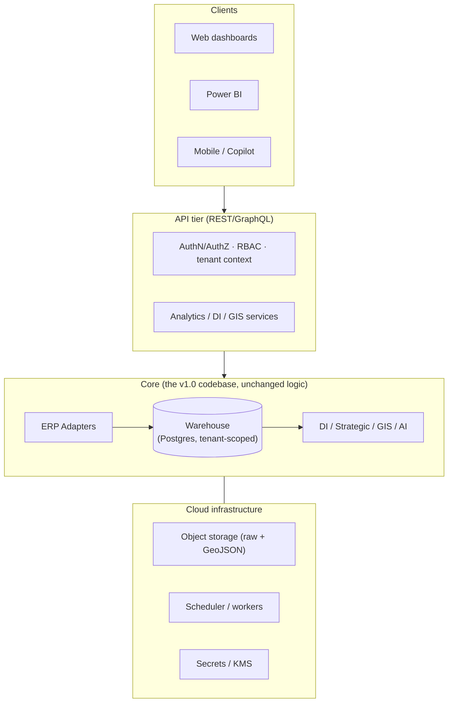

# SaaS Vision — From Single-Firm Tool to Multi-Tenant Platform

> v1.0 is a single-firm, local, file-based system by design (correct for the
> problem today). This document shows the **architecture** that lets the same
> codebase become a multi-tenant cloud platform without rewriting the analytics —
> because the hard parts (canonical model, INR source-of-truth, anonymisation,
> GeoJSON) are already in place.

## Target architecture

## Capability design

| Capability | v1.0 today | SaaS design |
|---|---|---|
| **Multi-company** | one firm | `tenant_id` on every row; row-level security; per-tenant config & secrets |
| **Multi-branch** | n/a | `branch_id` dimension; branch as a slicer everywhere; consolidation views |
| **Multi-warehouse** | single base in geo | `dim_geo_feature` already models warehouses as features; add `warehouse_id` to stock/movement facts |
| **Multi-currency** | INR base + reporting layer ✅ | per-tenant base currency; `dim_rate` per tenant; FX service |
| **Multi-language** | English | externalise strings (i18n catalogs); KPI/insight templates per locale; report localisation |
| **Role-based security** | file permissions | RBAC (owner/finance/sales/ops/admin); column & row policies; PII masking by role (the anonymiser already exists) |
| **Cloud deployment** | local venv | containerised workers; Postgres; object storage; IaC; CI/CD |
| **REST APIs** | none | `/kpis`, `/health-index`, `/forecasts`, `/geojson/{layer}`, `/reports/{type}` — serving the same artifacts |

## Migration path (incremental, low risk)

1. **Warehouse → Postgres.** Swap the SQLAlchemy engine (Layer 3 only). The
   schema registry already targets a generic SQL dialect.
2. **Tenant scoping.** Add `tenant_id` to the standard columns; every query
   filters by tenant context from the auth tier.
3. **API tier.** Wrap the existing runners (`di/run`, `strategic/run`, `geo/gis/run`,
   `powerbi/exports`) behind REST endpoints; they already return structured JSON.
4. **AuthN/Z + RBAC.** Reuse the anonymisation layer to mask PII per role.
5. **Cloud orchestration.** `run_pipeline.py` becomes a worker job triggered per
   tenant on new-export upload or schedule.
6. **i18n & multi-currency per tenant.** Externalise strings; per-tenant currency
   config.

## What makes this realistic

The expensive, risky things in a SaaS BI product are *already done*: a clean
canonical model, reconciled financials, an anonymisation/PII boundary, a currency
abstraction, a configurable analytics/KPI layer, and a portable GeoJSON spatial
model. SaaS is then mostly **infrastructure and tenancy**, not a rewrite of the
intelligence.
