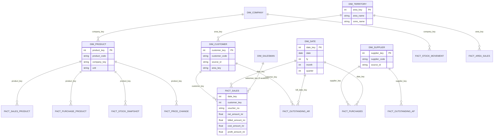

# Data Model & Relationship Mapping (Phase 1)

> Firm: Sukhakarta Distributors · pharmaceutical distribution. All identities
> shown as anonymous codes in any shared version. Source: 32 report types in
> `data/raw/`, loaded via the **ERP Adapter** (`src/adapters/`) which returns
> canonical, ERP-agnostic columns.

## 1. How the reports relate

The ERP exports are **report extracts**, not normalised tables. They link to each
other and to the master files through a small set of business keys:

| Link | From → To | Key | Quality (measured) |
|---|---|---|---|
| Sale → Customer | `Sales`, `Customer_Sales`, `Profit_AllBills`, `Outstanding_*` → `Customer_Master` | `customer_name` (+`address`) | **32% exact** → entity resolution required |
| Purchase → Supplier | `Purchase_Report`, `Payables_*`, `SupplierWise_Purchase` → `Supplier_Master` | `supplier_name` | **100% exact** |
| Product line → Product | `Sales_ProductWise`, `Profit_ProductWise`, `Purchase_ProductDetails`, `Stock_*`, `PTR_Changed` → `Product_Master` | `product_name` (+`unit`,`company`) | **100% exact** |
| Product → Manufacturer | `Product_Master.company_name`, `Stock_CompanyWise/InOut` → `Company_Master` | `company_name` | high |
| Customer → Territory | `Outstanding_CustomerWise.area`, `Area_Sales` → `Area_List` | `area_name` | area→zone hierarchy |
| Sale ↔ Profit | `Sales` ↔ `Profit_AllBills` | `(financial_year, voucher_no)` | see §3 |
| Salesman | `Salesman_Sale` → `Salesman_Master` | `salesman_name` | high |
| Time | every transactional report | `txn_date` → `dim_date` | FY 22-23 → 25-26 |

## 2. The central modeling constraint — two disconnected grains

There is **no line-item (bill × product) export**. The data splits into two grains
that cannot be joined to each other:

- **Bill grain** (`Sales`, `Purchase_Report`, `Profit_AllBills`, `Customer_Sales`):
  carries customer/supplier, date, voucher, and money — **but no product**.
- **Product grain, annual** (`Sales_ProductWise`, `Profit_ProductWise`,
  `Purchase_ProductDetails`): carries product and yearly totals — **but no
  customer, bill, or date beyond the financial year**.

**Consequence:** questions like *"which customer bought which product"* or
*"product mix within a single bill"* are **not answerable** from current exports.
Everything else (customer value, product performance, supplier spend, margins,
ageing, stock) is fully supported.

> **Future ERP ask (low effort, high value):** a Sales/Purchase **register with
> product line items** (date, voucher, customer, product, qty, rate, amount).
> The adapter + star schema are designed so this slots in as a new
> `fact_sales_line` without disturbing anything else.

## 3. Sale ↔ Profit voucher join (measured, post footer-strip)

> **Data-integrity note (found in Phase 2):** every export ends with a `Totals:`
> grand-total row + a `Generated at … using MediVision Platinum` provenance row.
> Before these are stripped, totals **double**. The adapter now removes them
> (`_strip_footers` scans all columns). All figures below are post-strip and
> reconcile to the ERP's own `Totals` row to the rupee.

- Join on the **composite key `(financial_year, voucher_no)`**. After footer
  removal `voucher_no` is unique within a FY (FY25-26: 42,846 ⋈ 42,846 exact).
- `Sales.net_amount` (FY25-26: **₹134.16M**, = ERP Totals exactly) **≠**
  `Profit.sale_billed_amount` (**₹139.61M**). These are **different measures** —
  `net_amount` is net of returns/schemes; `sale_billed_amount` is gross billed.
  `fact_sales` keeps both, each from its source, never conflated. Cost & profit
  (FY25-26 profit ₹7.19M ≈ 5.4%) come from `Profit_AllBills`.
- **Corrected scale:** true all-FY (22-23→25-26) sales ≈ **₹530.5M** (early Phase-1
  notes said ₹1.06B — that was 2× inflated by the footer rows).

## 4. Entity-Relationship Diagram (conceptual)

(Facts shown at their true grain; `FACT_SALES` is bill grain, `FACT_SALES_PRODUCT`
is annual product grain — they are deliberately separate per §2.)

## 5. Report → model role map

| Role | Reports |
|---|---|
| **Dimensions** | Customer_Master, Supplier_Master, Product_Master, Company_Master, Salesman_Master, Area_List/Zone_List |
| **Bill-grain facts** | Sales, Purchase_Report, Profit_AllBills (merged into fact_sales), Customer_Sales |
| **Product-grain facts** | Sales_ProductWise, Profit_ProductWise, Purchase_ProductDetails |
| **Snapshot facts** | ClosingStock (batch), Stock_ProductWise |
| **Movement fact** | Stock_InOutSummary (company grain) |
| **Outstanding facts** | Outstanding_BillWise & Receivables_Ageing (AR), Payables_Ageing_BillWise & SupplierWise (AP) |
| **Event fact** | PTR_Changed_Purchase (price changes) |
| **Aggregates** (derive or store) | Area_Sales, Salesman_Sale, SupplierWise_Purchase, Purchase_MonthWise, Profit_MonthlySummary, Stock_Company/CategoryWise |
| **Statement** | P_and_L (T-format; parsed specially, not a fact) |

See `docs/warehouse_schema.md` for the target star schema and
`docs/entity_resolution_strategy.md` for keys.
